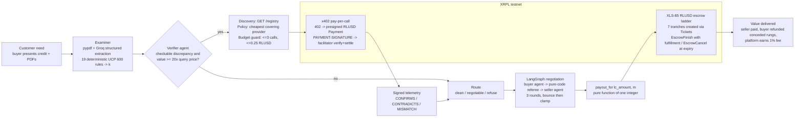

Team: Fozza · Product: MicroLC

# MicroLC — an AI-native letter of credit, settled in RLUSD on the XRP Ledger

MicroLC is a micro letter of credit (LC) for small cross-border trades. An AI examiner reads the
shipping documents, a verifier agent **buys external evidence over x402 when it is worth the price**,
two negotiation agents settle discrepancies inside a pure-code referee, and the money moves as a
**seven-tranche RLUSD escrow ladder (XLS-85 token escrow)** on XRPL testnet. Removing the agents
removes the product: nobody would examine, verify and negotiate a 10,000 RLUSD credit by hand for a
1% fee, and removing autonomous payments removes the verifier's ability to buy the evidence that
decides the case.

Built on the **XRPL AI Starter Kit**: the `x402-xrpl` merchant middleware protects the oracle, the
kit's `x402_requests` client pays for it, the hosted testnet facilitator verifies and settles, and the
kit's `xrpl-agentic-resources` skill plus feedback hook drove the build.

---

## 1. The customer problem

A documentary letter of credit pays the exporter once a bank finds the presented documents
(invoice, bill of lading, packing list) compliant with the credit under UCP 600. Today that is:

* **Manual and slow** — examiners check dozens of fields by hand; a presentation waits days.
* **Binary** — a single discrepancy means "refuse" or "waive"; small exporters lose bargaining power
  and pay demurrage while the parties argue.
* **Expensive** — fixed bank fees make LCs uneconomic below roughly USD 50k, so SME trade runs on open
  account risk instead.
* **Blind** — the bank sees paper only (UCP 600 Art. 5); nobody checks whether the vessel actually
  sailed or the container actually loaded.

**Target user:** SME importers and exporters (the fixtures use a Singapore apparel buyer and an Indian
yarn mill) and the platforms that serve them.

## 2. Product overview

| Stage | Who acts | What happens |
|---|---|---|
| Create | buyer | Credit terms plus the three documents (PDF) are presented. |
| Examine | AI examiner | Groq structured extraction of every field; 19 deterministic UCP 600 style rules produce `k` discrepancies with `found` vs `expected` and an article reference. |
| Verify | verifier agent | If a discrepancy is externally checkable and the disputed value is at least 20x the cheapest query, the agent discovers oracle providers, picks one by policy, **pays per call over x402 in RLUSD**, and turns signed telemetry into a deterministic adjustment: CONFIRMS keeps, CONTRADICTS drops, MISMATCH raises `FRAUD_SUSPECTED` and refuses. |
| Lock | buyer wallet | 101% of the credit is locked in **seven XLS-85 RLUSD escrows** (95% base, five 1% rungs, 1% platform fee), created in one ledger window with XRPL Tickets, each gated by a PREIMAGE-SHA-256 condition held by the platform. |
| Negotiate | buyer agent, seller agent, pure-code referee | LangGraph cycle: the buyer proposes rungs, the referee validates (rungs in `[0,k]`, citations are real rule ids, accept mirrors the counterparty), one bounce per actor per round then clamp; three rounds then default `m = k`. |
| Settle | platform wallet | `payout_for(lc_amount, m)`: base + fee + rungs `1..5-m` are finished with their fulfillments in one ledger window; conceded rungs expire back to the buyer. Refusal releases nothing. |

**Commercial model:** the platform earns the 1% fee tranche on every honoured credit; oracles earn
per-call RLUSD; the buyer's cost of dispute is bounded by the ladder; the seller is paid in minutes
instead of weeks.

## 3. Architecture



Runtime services: `main.py` (API + SSE, :8000), `oracle/service.py` (x402 oracle, :8001),
`frontend/` (Next.js 14: light landing page at `/`, dark console at `/console`, :3000). Optional `oracle/local_facilitator.py` (:8011) replaces the
hosted facilitator for offline tests or outages.

## 4. Setup (stranger-followable)

Prerequisites: Python 3.13, Node 18+, a Groq API key, network access to XRPL testnet.

```powershell
git clone https://github.com/<you>/Fozza-MicroLC.git
cd Fozza-MicroLC
py -3.13 -m venv .venv
.\.venv\Scripts\python.exe -m pip install -r requirements.txt
copy .env.example .env            # paste your GROQ_API_KEY; model ids live here too
.\.venv\Scripts\python.exe scripts\bootstrap_wallets.py   # faucet-funds 5 wallets, issuer flags, trust lines, mints RLUSD
```

`bootstrap_wallets.py` writes `state/wallets.json` (gitignored; contains seeds) and prints balances.
It enables `asfAllowTrustLineLocking` (flag 17) on the issuer so RLUSD can be escrowed, and
`asfDefaultRipple` so holders can pay each other.

Run the three services in three terminals:

```powershell
.\.venv\Scripts\python.exe -m oracle.service                       # x402 oracle on :8001
.\.venv\Scripts\python.exe -m uvicorn main:app --port 8000         # API + SSE on :8000
cd frontend; npm install; copy .env.example .env.local; npm run dev  # console on :3000
```

Open `http://localhost:3000` (landing page) and click **Open a Demo Credit**, or go straight to
`http://localhost:3000/console`. Choose a preset (Clean, Discrepant, Fraudulent), then
**New Deal → Examine Documents → Lock 101% on XRPL → Negotiate & Settle**. `/console?deal=<id>` reloads a
deal; **Upload PDFs** accepts your own invoice, bill of lading and packing list (10 MB each) and examines
them against the open deal's credit terms. Every label carries a hover tooltip written for non-specialists.

Tests:

```powershell
.\.venv\Scripts\python.exe -m pytest -m "not live"            # offline: rules, referee fuzz, settlement sums, x402 402/nonce/amount, API
.\.venv\Scripts\python.exe -m pytest -m live -s               # testnet + Groq: escrow spike, 7-escrow deal, parsers
.\.venv\Scripts\python.exe scripts\run_negotiation_live.py 3  # three live Groq negotiations
.\.venv\Scripts\python.exe scripts\run_verifier_live.py discrepant   # paid oracle call end to end (oracle must be up)
.\.venv\Scripts\python.exe proof_pack.py                      # full loops through the API, archives proof/negotiation_report.json
cd frontend; npx playwright test                              # headless click-through (API + frontend must be up)
```

Linux/macOS: replace `.\.venv\Scripts\python.exe` with `.venv/bin/python`.

## 5. How x402 is used

The oracle exposes `GET /verify/<provider>?bl=...` behind the starter kit's
`x402_xrpl.server.require_payment` middleware, one `require_payment` per provider with its own RLUSD
price (`0.05` and `0.20`), the RLUSD 40-hex currency code, the issuer in `extra.issuer`, a 300 s
`maxTimeoutSeconds` and the SDK's analytics `sourceTag`.

1. The verifier agent calls the endpoint. The middleware answers **HTTP 402** with a v2
   `PaymentRequired` body: `scheme: exact`, `network: xrpl:1`, `amount`, `asset`, `payTo`, and a
   fresh single-use `invoiceId` nonce bound in an in-memory invoice store.
2. The agent's `x402_requests` session (starter kit client, signing with the platform wallet) builds a
   **presigned XRPL `Payment`** for exactly that amount to `payTo`, binds the invoice by
   `Memo = hex(invoiceId)` and `InvoiceID = sha256(invoiceId)`, sets `LastLedgerSequence`, and retries
   with the `PAYMENT-SIGNATURE` header.
3. The middleware posts the payload to the facilitator (`xrpl-facilitator-testnet.t54.ai`): `/verify`
   checks type, destination, amount, asset/issuer, invoice binding, expiry and policy; `/settle`
   submits the blob to the ledger and returns the transaction hash.
4. Only then does our handler run. It returns telemetry **signed with the oracle's XRPL key**
   (`xrpl.core.keypairs.sign`), and the response carries `PAYMENT-RESPONSE` with the settled hash,
   which the agent records as evidence and the negotiation agents cite.

Replays cannot buy a second answer: the invoice is consumed after settlement (kit middleware) and the
facilitator refuses a reused invoice. Underpayment fails `/verify` and nothing settles
(`tests/test_oracle_offline.py`). `oracle/local_facilitator.py` implements the same three endpoints
for offline tests and as a fallback when the hosted facilitator is unreachable.

### Why x402 over MPP

Our purchases are **discrete, adversarial and evidentiary**: one query, one price, one receipt that a
counterparty must be able to audit later. x402 fits that shape exactly: the 402 challenge is a
quotation, the presigned Payment is an offer bound to a nonce, and the settlement hash is the receipt
that goes into the negotiation transcript and the refusal notice. The Machine Payments Protocol
(MPP) is built for metered sessions and streaming micro-charges, which would suit a continuous AIS
feed, but it adds session state and a channel lifecycle we do not need for two to three calls per
deal, and it produces a running balance rather than a per-fact receipt. x402 also lets the verifier
compare providers purely from their 402 quotes before spending anything, which is how the registry
policy works. If MicroLC later subscribes to live vessel tracking for the life of a voyage, MPP is
the right tool for that stream; x402 remains right for buying a fact.

## 6. XRPL AI Starter Kit integration

**Build time**

* `.claude/skills/xrpl-agentic-resources` (copied from the kit and refreshed) supplied the xrpl.org
  index, live amendment and fee snapshots, the XRPL-Standards specs (XLS-85 token escrow) and the
  x402 docs index that the oracle design follows.
* The kit's feedback hook (`hook/`, project-scoped `.claude/settings.json`) ran for the whole build
  and submitted builder feedback as friction appeared.
* The kit does not expose an XRPL Docs MCP server; the skill's fetched indexes were used instead.

**Runtime components used**

* `x402_xrpl.server.require_payment` — merchant middleware on the oracle (402 issuance, invoice
  store, facilitator verify and settle, `PAYMENT-RESPONSE`).
* `x402_xrpl.clients.x402_requests` and `decode_payment_response` — the verifier agent's paying client.
* `x402_xrpl.facilitator.AsyncFacilitatorClient` — pointed at the hosted testnet facilitator, or at
  our local facilitator over an in-process ASGI transport in tests.
* `xrpl-py` (the SDK the kit builds on) for wallets, trust lines, XLS-85 escrows, Tickets and signing.

**Honest gaps and how we resolved them**

* **Version conflict.** `x402-xrpl` pins `fastapi>=0.115,<0.116` and `uvicorn>=0.30,<0.31` while a
  default install resolves far newer versions. We pinned the whole project to the kit's range in
  `requirements.txt` from the start (lifespan, `StreamingResponse` SSE and CORS all work in
  0.115.x), so a single venv serves the API and the oracle. The package also pulls `redis`,
  `prometheus-client` and `openai` as hard dependencies we do not use.
* **`source_tag_mismatch`.** The hosted facilitator rejects payments whose requirements carry no
  `sourceTag`, but the 0.3.3 middleware omits it unless `source_tag=` is passed and the README still
  describes a default. We pass the SDK's analytics tag explicitly.
* **Structured output on Groq.** `with_structured_output` defaults to tool calling, which the
  `gpt-oss` models reject; `method="json_schema"` with `reasoning_effort="low"` and a 600-token budget
  is reliable. All LLM calls use pydantic schemas; no free text is parsed.
* **Wallet custody.** The demo server signs for buyer and platform from `state/wallets.json`. In
  production each party signs its own EscrowCreate and the platform holds only fulfillments.

## 7. Trust and governance

| Brief item | MicroLC |
|---|---|
| Transparency | Every agent step streams over SSE as `{ts_ms, round, actor, action, rungs, cited, rationale}` and is persisted in `state/deals/<id>/state.json`; the console shows real per-step latency. |
| Authorisation | Agents can only emit an `AgentOffer`. The referee (pure Python) rejects anything outside `[0,k]`, any citation that is not a real rule id, and any accept that does not mirror the counterparty; one bounce per actor per round, then clamp. Money is `payout_for(lc_amount, m)`, a pure function of one integer. |
| Spending controls | The verifier spends only when disputed value >= 20x the cheapest query, never more than 3 calls or 0.25 RLUSD per deal (`BudgetGuard`), and records why it chose a provider. |
| Security | Seeds live in gitignored `state/`; the API never returns fulfillments; escrows are condition-gated; invoices are single-use; oracle telemetry is signed with the oracle's XRPL key. |
| Traceability | Every EscrowCreate/Finish/Cancel and every x402 payment hash is archived (`docs/TRANSACTIONS.md`, `proof/`) and linked to the explorer from the console's ledger feed. |
| Failure handling | Oracle or facilitator failure emits a WARNING event and the deal proceeds on documents alone; Groq failure falls back to the deterministic parser and to legal conservative offers; unfinished tranches always return to the buyer at `CancelAfter` (`sweep`). |
| Safeguards | Fatal rules and `FRAUD_SUSPECTED` route to refusal, which releases nothing; `k > 5` is refused; the recursion limit caps the graph. |

## 8. Transaction hashes

The full explorer-linked table is in [`docs/TRANSACTIONS.md`](docs/TRANSACTIONS.md). Headline set:

| What | Hash |
|---|---|
| Issuer `AccountSet asfAllowTrustLineLocking` | [`C624EADE…5FC781`](https://testnet.xrpl.org/transactions/C624EADE77DCD7385693853552399E42DB455C271B6146D177392F30795FC781) |
| RLUSD escrow create (100 RLUSD, conditional) | [`5641FC7A…5FC040`](https://testnet.xrpl.org/transactions/5641FC7A960F5A8332C5461FB1298E30B96F8228F1CC25C1D09623BF0F5FC040) |
| EscrowFinish with PREIMAGE-SHA-256 fulfillment | [`8143978D…F930B7`](https://testnet.xrpl.org/transactions/8143978D84B166DF9E77B7255F4E51233A73EDAB8B847586CFA0C6FC57F930B7) |
| Post-expiry EscrowCancel refund | [`48C41FF8…167CFE`](https://testnet.xrpl.org/transactions/48C41FF8D58DA1C31C31A8337A8A1D7FFACAE92440BA2D2042A0DF5C67167CFE) |
| Three ticketed EscrowCreates in one ledger | [`22F85CCD…D6D010`](https://testnet.xrpl.org/transactions/22F85CCDDEF048FC57338351BD6FD199E796A224647468A08BBB534206D6D010) · [`7D64572B…C56F48`](https://testnet.xrpl.org/transactions/7D64572B944612BB1C9904E1195582884EA7FC43A5935F97B389431CB6C56F48) · [`D25730AF…657944`](https://testnet.xrpl.org/transactions/D25730AF7D35C6354AB98BEF60B6A1DF4FA4EB33205D61B4325EA7B2E4657944) |
| x402 payment, 0.05 RLUSD to oracle (discrepant, CONFIRMS) | [`1B68E959…72561C`](https://testnet.xrpl.org/transactions/1B68E959E43629396882C0EFE5425695080AE6E2F0492499D35C82CDDB72561C) |
| x402 payment, 0.05 RLUSD to oracle (fraudulent, MISMATCH → refuse) | [`5A3372B1…78D7E`](https://testnet.xrpl.org/transactions/5A3372B1BD9211305FAB0B04ECD5870F10D0A0472E1BBEF41C50AE5000878D7E) |
| Seven-tranche lock, base tranche | [`1B9F1C46…D39DE`](https://testnet.xrpl.org/transactions/1B9F1C46F5CB5EE8FE2A1DE6E7335B6ECB7B0B4CAE3EC1143F90BF99090D39DE) |
| Ladder settlement m=2, fee EscrowFinish | [`34E09BE4…83431F`](https://testnet.xrpl.org/transactions/34E09BE4591699FB543369EE3E4AA66E4D4F46EB94F2D26CFA600FD7F383431F) |

## 9. Production considerations

* **Ledger speed.** One XRPL ledger closes in about four seconds on testnet but reliable
  `submit_and_wait` costs a ledger or more per transaction. Sequential creation of seven escrows took
  close to two minutes in early runs; **Tickets** let us sign all seven with `TicketSequence` and fire
  them together, and the same trick settles the whole ladder in one window (see
  `proof/tickets_spike.json`). Finishes must land before `CancelAfter`; the demo expiry is 180 s, a
  production credit uses the presentation period.
* **Token budgets.** A negotiation costs three to six model calls of roughly 800 tokens each; the
  prompts are kept near 1.2k tokens so live runs fit an 8k tokens-per-minute tier. Extraction uses the
  small model, negotiation the large one; ids live in `.env` and are re-selected from the models
  endpoint, never hard-coded.
* **Costs.** On-ledger fees are drops; the material costs are oracle calls (bounded by the budget
  guard) and inference. The 1% fee tranche covers both at 10,000 RLUSD.
* **Custody and compliance.** Buyer and seller should sign their own transactions (Xaman, Crossmark or
  an OpenWallet-style policy wallet); the platform holds fulfillments only. RLUSD trust lines and
  issuer flags map onto a regulated issuer's controls. Refusal notices follow UCP 600 Art. 16(c).
* **Reliability.** Every external dependency has a fallback: template parser for Groq, local
  facilitator for the hosted one, documents-only routing for the oracle, expiry sweep for any stalled
  settlement.

## Repository map

```
xrpl_escrow.py          ledger layer: faucet, trust lines, XLS-85 escrows, crypto-conditions, Tickets
settlement_engine.py    tranche plan, payout_for(m), decide(m), SettlementEngine (fake-ledger testable)
doc_generator.py        three fixture presets (reportlab)
examiner.py             pypdf -> Groq/template parsers -> 19 UCP 600 rules
ucp_articles.py         one-line article references
negotiator_graph.py     LangGraph graph, pure-code referee, event schema
negotiation_agents.py   Groq buyer/seller/refusal agents (structured output only)
verifier_agent.py       discover -> decide -> x402 pay -> evidence, budget guard
oracle/service.py       x402 oracle (starter kit require_payment), signed telemetry, registry
oracle/local_facilitator.py  minimal /supported /verify /settle facilitator (fallback, tests)
main.py                 FastAPI API + SSE + persistence
frontend/               Next.js 14 console + Playwright e2e
scripts/                bootstrap_wallets, live runners, tickets spike, hash table
tests/                  offline (default) and live (-m live) suites
proof/                  archived runs, hashes, balances
docs/                   TRANSACTIONS.md, VIDEO_SCRIPT.md
```
